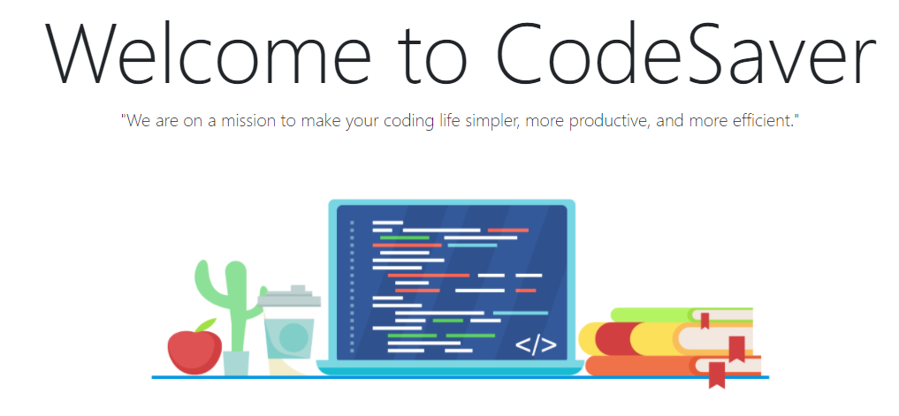
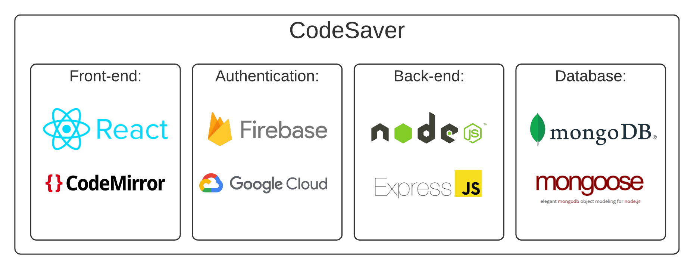
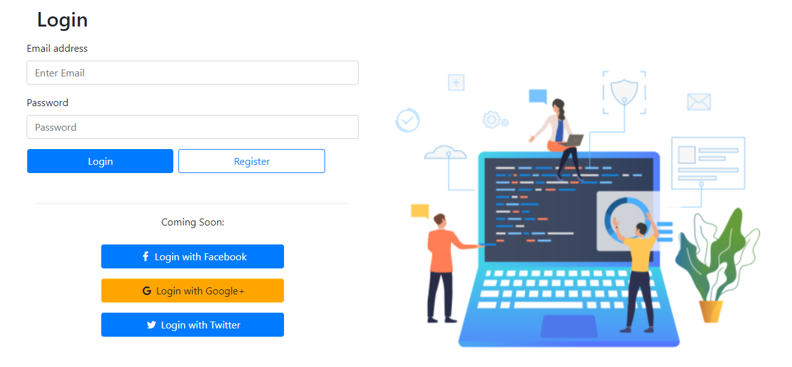
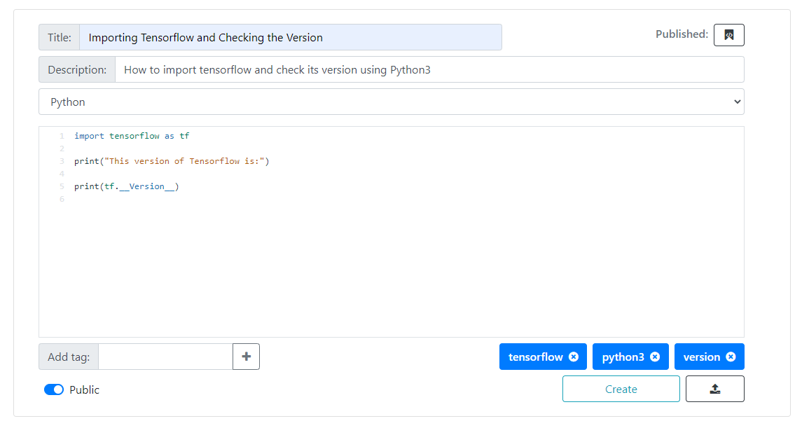
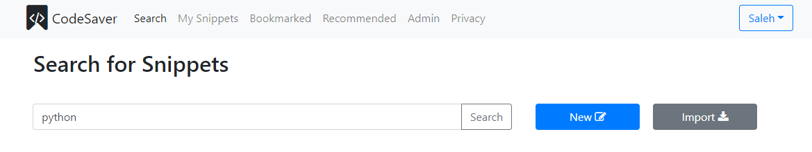

# CodeSaver (V2.1)

<a href="https://github.com/whysgai/WebDev_FinalProject">Client Repo</a> | 
<a href="https://github.com/alkhalifas/cs5610-f20-server-node-alkhalifas">Server Repo</a> 

**Engineers:**  
Saleh Alkhalifa, Will Cohen, Nic Shepard

## What is CodeSaver?

CodeSaver is an application designed for the purpose of helping developers of 
various computer languages save, find and recycle their code with ease. The 
platform includes a number of features that allow users to find, read, and edit code
saved in snippets. Users can create and edit their own 
snippets, search snippets by tag/topic, view and save other users' snippets, and 
view admin-recommended snippets. They can also import snippets from and export
snippets to GitHub via the GitHub Gists API.

## Meet the Team:
[Saleh Alkhalifa](https://www.linkedin.com/in/saleh-alkhalifa/) | 
[Nic Shepard](https://www.linkedin.com/in/nicholas-shepard-2018/) | 
[Will Cohen](https://www.linkedin.com/in/william-cohen-867a4231/)

## Built With:

## Highlighted Features

### Full User Authentication:

### Integrated Code Editor:

### Search for Snippets Easily:

## How to run CodeSaver Locally

Clone the project:

    git clone git@github.com:whysgai/WebDev_FinalProject.git
    
Install Dependencies:

    npm install
    
Run the application:

    npm run start-local

## How to access CodeSaver online:

To access CodeSaver online, please visit [this url.](https://cs5610-project-group3-v2.herokuapp.com/)

### Sample Test Users
- Admin User: admin@codesaver.com / password123
- User One:  user1@codesaver.com / password123
- User Two:  user2@codesaver.com / password123
- Gist User:  gistuser@codesaver.com / password123

## Test Github
- group3person / nicsalehwill3

